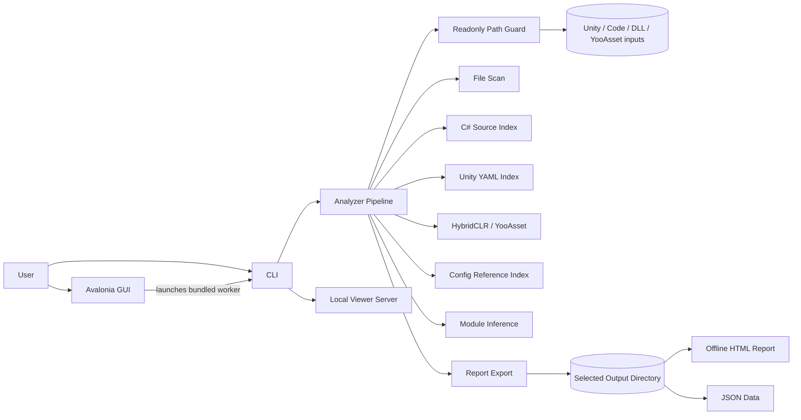

# OfflineUnityAnalyzer

[简体中文](README.zh-CN.md) | English

OfflineUnityAnalyzer is an offline, read-only Unity project understanding tool. It scans a Unity project without opening Unity, building the target project, restoring packages, or touching source assets, then writes a navigable project map to a separate output directory.

It is designed for large projects where you want to answer questions such as:

- Where are scripts, prefabs, scenes, GUIDs, YooAsset addresses, and hot-update assemblies used?
- Which modules exist, and how are they inferred from code, assemblies, packages, and asset paths?
- What can be understood safely from C# source, Unity YAML, DLL metadata, HybridCLR evidence, YooAsset manifests, and config-like files?

## Highlights

- **Offline by default**: no Unity Editor, no target project build, no restore, no network.
- **Readonly guard**: input roots are registered as read-only; output must stay outside them.
- **GUI-first workflow**: select a Unity root, auto-discover likely inputs, run analysis, open the report.
- **CLI automation**: repeatable `analyze` and `serve` entry points for scripts and CI-like local workflows.
- **Unity-aware indexing**: C# types, project model files, DLL metadata, Unity YAML objects, GameObjects, Components, asset references, HybridCLR clues, YooAsset assets, and config references.
- **Local report export**: JSON data plus an offline static HTML report.

## Quick Start

Download or build the Windows package, then run:

```text
OfflineUnityAnalyzer.exe
```

Recommended GUI flow:

1. Select the Unity project root.
2. Click `自动发现路径`.
3. Review the discovered C# code roots, DLL/HybridCLR roots, and YooAsset manifest roots.
4. Keep the suggested output directory or choose another directory outside the project.
5. Click `开始分析`.
6. Open the generated report from the top-right `打开报告` button.

CLI equivalent:

```bat
OfflineUnityAnalyzer.Cli.exe analyze ^
  --unity D:\UnityProject ^
  --code D:\UnityProject\Assets ^
  --dll D:\UnityProject\Assets\Plugins ^
  --yooasset-manifest D:\UnityProject\ServerData ^
  --out D:\AnalyzerOutput ^
  --strict-readonly
```

## Architecture



| Project | Responsibility |
| --- | --- |
| `OfflineUnityAnalyzer.App` | Avalonia desktop shell, path discovery, progress display, report opening |
| `OfflineUnityAnalyzer.Cli` | `analyze`, `serve`, planned `diff` and `export` commands |
| `OfflineUnityAnalyzer.Core` | shared models, configuration, pipeline contracts, readonly safety |
| `OfflineUnityAnalyzer.Analyzers` | file scan, C# source, DLL, Unity YAML, HybridCLR, YooAsset, config, modules, report stage |
| `OfflineUnityAnalyzer.ReportExport` | offline static report generation |
| `OfflineUnityAnalyzer.ViewerServer` | local read-only `127.0.0.1` viewer API shell |
| `OfflineUnityAnalyzer.Indexing` | future index metadata and query storage |

## Analysis Output

An analysis writes only to the selected output directory:

```text
AnalyzerOutput/
  summary.json
  data/
    types.json
    project-model.json
    modules.json
    assemblies.json
    unity-script-refs.json
    unity-objects.json
    unity-gameobjects.json
    unity-components.json
    unity-asset-refs.json
    hybridclr.json
    yooasset.json
    config-refs.json
    diagnostics.json
  report/
    report.html
  logs/
    readonly-preflight.txt
```

## Readonly Safety Model

OfflineUnityAnalyzer must not create, modify, or delete files under:

- the analyzed Unity project
- source roots
- DLL roots
- local or embedded packages
- YooAsset manifest roots

All generated files go to the user-selected output directory. The output directory must not be inside any input root, and input roots must not be inside the output directory.

The GUI may store its own application settings in the normal app data area, but it does not write analysis data into the target project.

## Build

Requires .NET 8 SDK.

```bash
dotnet build OfflineUnityAnalyzer.sln
dotnet test OfflineUnityAnalyzer.sln --no-build
```

Create a local Windows package:

```bash
./build/package.sh
```

The package is written to:

```text
publish/OfflineUnityAnalyzer-win-x64.zip
```

## Release

GitHub Release packages are built by `.github/workflows/release.yml`.

```bash
git tag -a v0.5.0 -m "发布 v0.5.0"
git push origin main --tags
```

Release notes are kept under `docs/release-notes-v*.md`.

## Roadmap

The v1 product architecture is tracked in [docs/product-architecture-v1.md](docs/product-architecture-v1.md). Planned areas include richer search, viewer server APIs, graph navigation, prefab merge views, diagnostics, diff, and static export refinements.
