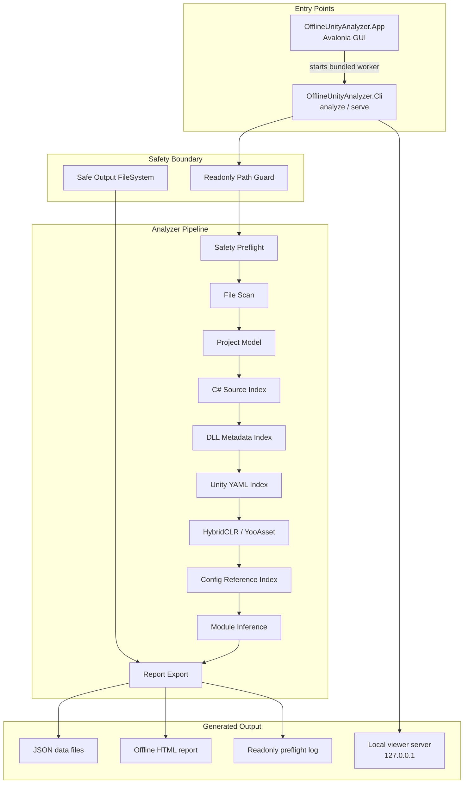

# OfflineUnityAnalyzer

English | [简体中文](README.zh-CN.md)

OfflineUnityAnalyzer is an offline, read-only Unity project understanding tool. It scans a Unity project without opening Unity, building the target project, restoring packages, or touching source assets, then writes a navigable project map to a separate output directory.

| Status | Value |
| --- | --- |
| Primary entry | `OfflineUnityAnalyzer.exe` desktop GUI |
| Automation entry | `OfflineUnityAnalyzer.Cli.exe analyze` |
| Runtime | .NET 8 |
| Current package | Windows x64 self-contained zip |
| Safety model | Read inputs, write only selected output directory |
| Target Unity patterns | C# projects, Unity YAML, HybridCLR, YooAsset, DLL metadata, config-like references |

## Contents

- [Why](#why)
- [Highlights](#highlights)
- [Quick Start](#quick-start)
- [Selective Analysis](#selective-analysis)
- [Architecture](#architecture)
- [What Gets Indexed](#what-gets-indexed)
- [Analysis Output](#analysis-output)
- [Readonly Safety Model](#readonly-safety-model)
- [Build](#build)
- [Release](#release)
- [Roadmap](#roadmap)

## Why

Large Unity projects often mix source code, generated project files, serialized YAML assets, managed DLLs, hot-update assemblies, addressable-like resource systems, and configuration files. OfflineUnityAnalyzer gives you a local map of that project without requiring the Unity Editor or any target-project build step.

Use it when you want to answer:

- Where are scripts, prefabs, scenes, GUIDs, YooAsset addresses, and hot-update assemblies used?
- Which modules exist, and how are they inferred from code, assemblies, packages, and asset paths?
- What can be understood safely from C# source, Unity YAML, DLL metadata, HybridCLR evidence, YooAsset manifests, and config-like files?

## Highlights

- **Offline by default**: no Unity Editor, no target project build, no restore, no network.
- **Readonly guard**: input roots are registered as read-only; output must stay outside them.
- **GUI-first workflow**: select a Unity root, auto-discover likely inputs, run analysis, open the report.
- **CLI automation**: repeatable `analyze` and `serve` entry points for scripts and local automation.
- **Unity-aware indexing**: C# types, code relationships, project model files, DLL metadata, Unity YAML objects, GameObjects, Components, asset references, HybridCLR clues, YooAsset assets, and config references.
- **Project map report**: an offline HTML report focused on modules, important types, code relations, Unity bindings, asset chains, and diagnostics.

## Quick Start

Download or build the Windows package, then run:

```text
OfflineUnityAnalyzer.exe
```

Recommended GUI flow:

1. Select the Unity project root.
2. Click `自动发现路径`.
3. Review the discovered C# code roots, DLL/HybridCLR roots, and YooAsset manifest roots.
4. Keep the suggested output directory or choose another directory outside the project.
5. Click `开始分析`.
6. Open the generated report from the top-right `打开报告` button.

Split-project layouts are supported. If your precompiled C# source lives next to the Unity project while Unity only contains compiled DLLs, keep `AutoDiscoverSiblingCodeRoots` enabled or add the source folder with `--code`. The analyzer will index both roots and link source types back to matching compiled DLL metadata.

CLI equivalent:

```bat
OfflineUnityAnalyzer.Cli.exe analyze ^
  --unity D:\UnityProject ^
  --code D:\UnityProject\Assets ^
  --dll D:\UnityProject\Assets\Plugins ^
  --yooasset-manifest D:\UnityProject\ServerData ^
  --out D:\AnalyzerOutput ^
  --strict-readonly
```

## Selective Analysis

Large projects do not always need a full pass. The GUI includes an `分析范围` panel where each analyzer can be toggled. `快速模式` keeps project model, C# source, HybridCLR, YooAsset, and module inference enabled, while skipping heavier DLL, Unity YAML, and config scans.

The same controls are available in the CLI:

```bat
OfflineUnityAnalyzer.Cli.exe analyze ^
  --unity D:\UnityProject ^
  --out D:\AnalyzerOutput ^
  --strict-readonly ^
  --skip-unity-yaml ^
  --skip-config
```

Available skip flags:

| Flag | Effect |
| --- | --- |
| `--skip-project-model` | Skip `.sln`, `.csproj`, `.asmdef`, package model parsing |
| `--skip-source` | Skip C# type/member indexing |
| `--skip-dll` | Skip `.dll` and `.dll.bytes` metadata indexing |
| `--skip-type-merge` | Skip source-to-compiled-DLL matching |
| `--skip-unity-yaml` | Skip scene, prefab, and Unity asset YAML parsing |
| `--skip-hybridclr` | Skip HybridCLR evidence detection |
| `--skip-yooasset` | Skip YooAsset evidence, manifests, and code reference scan |
| `--skip-config` | Skip JSON, CSV, XML, and readable `.bytes` shallow reference scan |
| `--skip-modules` | Skip module inference |
| `--skip-report` | Skip offline report export |
| `--no-auto-discover-sibling-code` | Disable automatic sibling source-root discovery |

## Architecture



| Layer | Project | Responsibility |
| --- | --- | --- |
| Desktop | `OfflineUnityAnalyzer.App` | Avalonia shell, path discovery, progress display, report opening |
| Command line | `OfflineUnityAnalyzer.Cli` | `analyze`, `serve`, planned `diff` and `export` commands |
| Core | `OfflineUnityAnalyzer.Core` | shared models, configuration, pipeline contracts, readonly safety |
| Analysis | `OfflineUnityAnalyzer.Analyzers` | file scan, C# source, DLL, Unity YAML, HybridCLR, YooAsset, config, modules, report stage |
| Export | `OfflineUnityAnalyzer.ReportExport` | offline static report generation |
| Viewer | `OfflineUnityAnalyzer.ViewerServer` | local read-only `127.0.0.1` viewer API shell |
| Indexing | `OfflineUnityAnalyzer.Indexing` | future index metadata and query storage |

## What Gets Indexed

| Domain | Current signals |
| --- | --- |
| C# source | type names, namespaces, members, serialized fields, MonoBehaviour/ScriptableObject hints, and inferred type relationships |
| Source/DLL bridge | external source types matched to compiled Unity DLL metadata, including hot-update assembly matches |
| Project model | `.sln`, `.csproj`, `.asmdef`, `.asmref`, `Packages/manifest.json`, package lock files |
| Managed assemblies | `.dll`, `.dll.bytes`, assembly name, version, public key token, hot-update hints |
| Unity assets | scenes, prefabs, assets, controllers, materials, animations, `.meta` GUID data |
| Serialized objects | Unity YAML object IDs, GameObjects, Components, script references, asset references |
| HybridCLR | hot-update and AOT metadata directory/file evidence |
| YooAsset | manifest assets, package names, addresses, asset paths, bundles, tags, C# load API literals |
| Config files | shallow references from JSON, CSV, XML, and readable `.bytes` files |

## Analysis Output

An analysis writes only to the selected output directory:

```text
AnalyzerOutput/
  summary.json
  data/
    types.json
    source-relations.json
    code-assembly-bridges.json
    project-model.json
    modules.json
    assemblies.json
    unity-script-refs.json
    unity-objects.json
    unity-gameobjects.json
    unity-components.json
    unity-asset-refs.json
    hybridclr.json
    yooasset.json
    config-refs.json
    diagnostics.json
  report/
    report.html
  logs/
    readonly-preflight.txt
```

## Readonly Safety Model

OfflineUnityAnalyzer must not create, modify, or delete files under:

- the analyzed Unity project
- source roots
- DLL roots
- local or embedded packages
- YooAsset manifest roots

All generated files go to the user-selected output directory. The output directory must not be inside any input root, and input roots must not be inside the output directory.

The GUI may store its own application settings in the normal app data area, but it does not write analysis data into the target project.

## Build

Requires .NET 8 SDK.

```bash
dotnet build OfflineUnityAnalyzer.sln
dotnet test OfflineUnityAnalyzer.sln --no-build
```

Create a local Windows package:

```bash
./build/package.sh
```

The package is written to:

```text
publish/OfflineUnityAnalyzer-win-x64.zip
```

## Release

GitHub Release packages are built by `.github/workflows/release.yml`.

```bash
git tag -a v0.5.0 -m "发布 v0.5.0"
git push origin main --tags
```

Release notes are kept under `docs/release-notes-v*.md`.

## Roadmap

The v1 product architecture is tracked in [docs/product-architecture-v1.md](docs/product-architecture-v1.md). Planned areas include richer search, viewer server APIs, graph navigation, prefab merge views, diagnostics, diff, and static export refinements.
