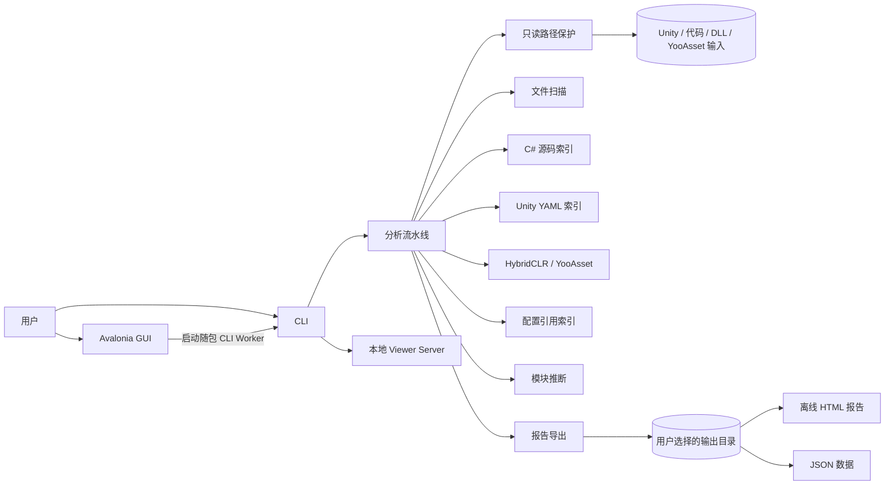

# OfflineUnityAnalyzer

简体中文 | [English](README.md)

OfflineUnityAnalyzer 是一个离线、只读的 Unity 项目理解工具。它不会打开 Unity，不会构建目标项目，不会 restore 目标项目依赖，也不会改动源码和资源；分析结果只写入你选择的输出目录。

它适合大型 Unity 项目，用来快速回答这些问题：

- 脚本、Prefab、Scene、GUID、YooAsset 地址、热更新程序集在哪里被使用？
- 项目里有哪些模块？这些模块如何从代码、程序集、包和资源路径里推断出来？
- 在离线只读前提下，能从 C# 源码、Unity YAML、DLL 元数据、HybridCLR 线索、YooAsset Manifest、配置文件里理解到什么？

## 功能亮点

- **默认离线**：不启动 Unity Editor，不构建目标项目，不 restore，不访问网络。
- **只读保护**：输入根目录注册为只读，输出目录必须位于输入目录之外。
- **GUI 优先**：选择 Unity 根目录后自动发现路径，运行分析，打开报告。
- **CLI 自动化**：提供可重复执行的 `analyze` 和 `serve` 入口，适合脚本化本地流程。
- **Unity 语义索引**：支持 C# 类型、项目模型文件、DLL 元数据、Unity YAML 对象、GameObject、Component、资源引用、HybridCLR 线索、YooAsset 资源、配置引用。
- **本地报告导出**：输出 JSON 数据和离线静态 HTML 报告。

## 快速开始

下载或构建 Windows 包后运行：

```text
OfflineUnityAnalyzer.exe
```

推荐 GUI 流程：

1. 选择 Unity 项目根目录。
2. 点击 `自动发现路径`。
3. 检查自动发现的 C# 代码根目录、DLL/HybridCLR 根目录、YooAsset Manifest 根目录。
4. 使用默认输出目录，或选择一个不在项目里的输出目录。
5. 点击 `开始分析`。
6. 通过右上角 `打开报告` 查看结果。

等价 CLI 示例：

```bat
OfflineUnityAnalyzer.Cli.exe analyze ^
  --unity D:\UnityProject ^
  --code D:\UnityProject\Assets ^
  --dll D:\UnityProject\Assets\Plugins ^
  --yooasset-manifest D:\UnityProject\ServerData ^
  --out D:\AnalyzerOutput ^
  --strict-readonly
```

## 架构



| 项目 | 职责 |
| --- | --- |
| `OfflineUnityAnalyzer.App` | Avalonia 桌面壳、路径发现、进度展示、打开报告 |
| `OfflineUnityAnalyzer.Cli` | `analyze`、`serve`，以及计划中的 `diff`、`export` 命令 |
| `OfflineUnityAnalyzer.Core` | 共享模型、配置、流水线契约、只读安全 |
| `OfflineUnityAnalyzer.Analyzers` | 文件扫描、C# 源码、DLL、Unity YAML、HybridCLR、YooAsset、配置、模块、报告阶段 |
| `OfflineUnityAnalyzer.ReportExport` | 离线静态报告生成 |
| `OfflineUnityAnalyzer.ViewerServer` | 本地只读 `127.0.0.1` Viewer API 壳 |
| `OfflineUnityAnalyzer.Indexing` | 后续索引元数据和查询存储 |

## 分析输出

分析过程只写入用户选择的输出目录：

```text
AnalyzerOutput/
  summary.json
  data/
    types.json
    project-model.json
    modules.json
    assemblies.json
    unity-script-refs.json
    unity-objects.json
    unity-gameobjects.json
    unity-components.json
    unity-asset-refs.json
    hybridclr.json
    yooasset.json
    config-refs.json
    diagnostics.json
  report/
    report.html
  logs/
    readonly-preflight.txt
```

## 只读安全模型

OfflineUnityAnalyzer 禁止在以下目录中创建、修改或删除文件：

- 被分析的 Unity 项目
- 源码根目录
- DLL 根目录
- 本地包或嵌入包
- YooAsset Manifest 根目录

所有生成文件都写入用户选择的输出目录。输出目录不能位于任何输入根目录内，输入根目录也不能位于输出目录内。

GUI 可以在系统正常应用数据目录保存自己的设置，但不会把分析数据写进目标项目。

## 构建

需要 .NET 8 SDK。

```bash
dotnet build OfflineUnityAnalyzer.sln
dotnet test OfflineUnityAnalyzer.sln --no-build
```

创建本地 Windows 包：

```bash
./build/package.sh
```

生成位置：

```text
publish/OfflineUnityAnalyzer-win-x64.zip
```

## 发布

GitHub Release 包由 `.github/workflows/release.yml` 构建。

```bash
git tag -a v0.5.0 -m "发布 v0.5.0"
git push origin main --tags
```

发布说明位于 `docs/release-notes-v*.md`。

## 路线图

v1 产品架构记录在 [docs/product-architecture-v1.md](docs/product-architecture-v1.md)。后续计划包括更强搜索、Viewer Server API、图导航、Prefab 合并视图、诊断、Diff 和静态导出增强。
